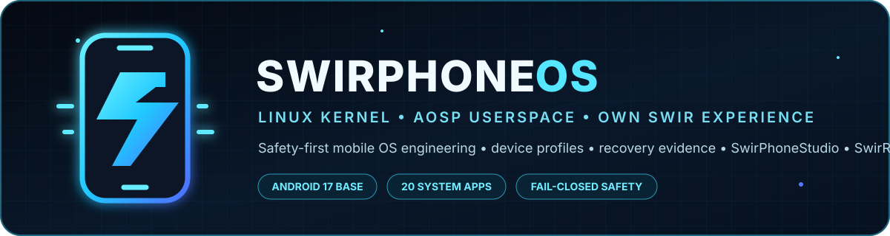
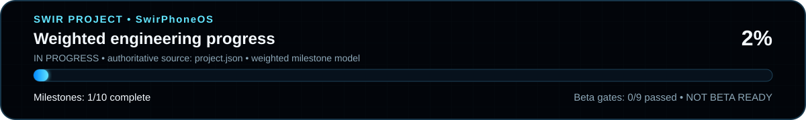

<!-- SWIR-README-STANDARD:v2 -->

<div align="center">



<br />


**Linux kernel + AOSP-compatible userspace • own Swir UI/services/apps • safe device profiles • SwirPhoneStudio • SwirRoot**

</div>


> [!IMPORTANT]
> **Developer foundation — not a ROM release.** There is currently no public bootable SwirPhoneOS image, supported phone, installer or beta release. Source code, build contracts and evidence tooling are real; runtime and hardware support are not claimed until a reproducible AOSP build, real boot and physical-device validation exist.

## 📊 Project status

**2% — 1/10 weighted engineering milestones completed. Beta readiness: 0/9 gates passed.**



The authoritative progress ledger is [`project.json`](project.json). Host CI, source-ready apps, Windows packaging, local recovery preparation and read-only hardware correlation do **not** substitute for Android build/boot or physical validation.

| Area | Current verified state |
|---|---|
| Android baseline | `android-17.0.0_r1` / API 37 pinned, not built |
| Cuttlefish | Product source integrated; not built or booted |
| ARM64 GSI | Source/build-evidence path exists; no real `system.img` evidence yet |
| System apps | 20 `ANDROID_SOURCE`, 0 `ANDROID_RUNTIME`, 0 hardware-verified |
| SwirPhoneStudio | Read-only ADB/Fastboot diagnostics, owner-visible physical capture wizard, local SwirRoot-readiness review, Windows developer packaging |
| Device support | No supported phone yet; `oneplus/avicii` is `PLANNED_NOT_SUPPORTED` |
| SwirRoot | Source-stage UI/policy/readiness evidence only; mutation backend disabled, supported builds = 0 |
| Release | No public beta or OS image |

Detailed evidence status: [`BUILD_STATUS.md`](BUILD_STATUS.md).

## ⚡ Highlights

- **Own mobile OS direction:** Linux kernel + AOSP/Android-compatible userspace and HAL/device integration where practical, with SwirPhoneOS UI, services, apps and branding on top.
- **Common core + exact device profiles:** broad compatibility is a goal, but one generic image or flashing recipe is never advertised as safe for every Android device.
- **20 first-party system apps:** every required everyday-app slot has meaningful Android source integrated into the developer product; none is counted as runtime before the image actually builds and exercises it.
- **Fail-closed build provenance:** exact Android 17 baseline, resolved Repo manifest, clean exact Git worktree verification before and after the build, bounded `vendor/swir/` staging, stale-tree rejection, pinned build identity and Cuttlefish/GSI evidence contracts.
- **SwirPhone least privilege:** outgoing calls remain an explicit Android `ACTION_DIAL` hand-off; in-call controls require the owner-approved default-phone role; recent-call history is read-only, bounded, role-gated and requests only `READ_CALL_LOG`, with no `CALL_PHONE` or `WRITE_CALL_LOG` path.
- **Swir Camera source-stage capture:** exactly `CAMERA` permission; owner-triggered Camera2 live preview and JPEG still capture save through scoped MediaStore, while video stays an explicit Android hand-off and all runtime/photo-quality/device claims remain blocked until real validation.
- **SwirPhoneStudio:** dark/electric-cyan Windows-first companion with trusted ADB/Fastboot selection, read-only diagnostics, a manual ADB → Fastboot/FastbootD evidence capture wizard and local validation of SwirRoot readiness evidence. It exposes no flash/root controls today.
- **SwirRoot safety model:** deny-by-default, exact-build policy, rollback/journal requirements, explicit owner confirmation design and a reliable unroot requirement before any supported root claim.
- **Worldwide localization architecture:** shared host catalogs plus EN/PL/NB/DE/ES/FR/PT/AR Android resources, English fallback, RTL-aware Android configuration and localization linting.

## 📱 Essential system apps

All twenty required app slots are currently **source-ready only** and included in the developer product. They remain below `ANDROID_RUNTIME` until the pinned system builds and the apps are exercised in that exact runtime.

| App | Current source-stage capability |
|---|---|
| Phone | Explicit Android `ACTION_DIAL`, owner-controlled default-dialer role and in-call answer/reject/end source, plus bounded read-only recent calls behind the same role and explicit `READ_CALL_LOG`; runtime Telecom/modem/IMS behavior remains unverified |
| Contacts | Scoped `READ_CONTACTS`, browse/search, Android-managed edit/create, vCard import/export |
| Messages | Local draft/composer + explicit `ACTION_SENDTO`; no silent SMS; MMS/history still open |
| Camera | Exactly `CAMERA`; first-party Camera2 live preview, front/back selection and owner-triggered direct JPEG still capture with scoped pending-row MediaStore save/cleanup under `Pictures/SwirPhoneOS`; video remains an explicit Android hand-off; runtime, photo quality and exact-device behavior remain unverified |
| Gallery | Scoped MediaStore browse/search/open/share, bounded bucket-based album grouping/filtering + owner-confirmed delete; runtime provider behavior remains unverified |
| Files | Storage Access Framework browse/search/create/rename/copy/move/delete/open/share |
| Settings | Searchable Swir hub + reviewed Android settings routes |
| Browser | HTTPS-first WebView with conservative privacy defaults + app-scoped owner-visible `DownloadManager` downloads; runtime redirect/provider behavior unverified |
| Clock | Localized clock, foreground stopwatch/timer + visible alarm hand-off |
| Calculator | Host-tested `BigDecimal` basic arithmetic plus source-stage scientific operations (`sin`, `cos`, `tan`, square root, logarithms, reciprocal, constants and DEG/RAD); Android runtime/visual behavior unverified |
| Notes | App-private SQLite CRUD/search/share + Markdown export |
| Voice Recorder | Foreground-only private AAC/MPEG-4 record/playback/export |
| Calendar | Local SQLite agenda/search + bounded owner-selected ICS import/export/share + owner-visible Android calendar hand-off; no direct calendar-write permission |
| Weather | Bounded Open-Meteo HTTPS current-weather lookup for owner-entered coordinates |
| System Updater | Read-only build/channel state + SHA-256/RSA metadata verification; install disabled |
| Backup/Restore | Owner-selected bounded schema-v2 document backup with per-file SHA-256, strict inspection and SAF restore into an explicitly chosen folder; Android runtime/provider behavior unverified |
| Privacy Center | Reviewed routes into Android privacy/permission surfaces |
| Device Care | Framework-backed battery/storage/memory/thermal diagnostics |
| Software Center | Local app catalog, version/signing SHA-256 provenance, launch/details hand-off |
| SwirRoot | Owner-facing state/safety UI + non-exported diagnostics; mutation backend disabled |

Machine-readable registry: [`system_apps/manifest.json`](system_apps/manifest.json).

## 🚀 Quick Start

There is no end-user installer yet. For development, begin with the host-side validation surfaces:

```sh
python -m unittest discover -s tests -v
python -m swirphoneos status
python -m swirphoneos gate
python -m swirphoneos profiles
python -m swirphoneos baseline
python -m swirphoneos product-contract
python -m swirphoneos gsi-contract
python -m swirphoneos android-apps
python -m swirphoneos i18n
python -m swirphoneos apps
python -m swirphoneos root-policy
```

`gate` intentionally remains blocked while mandatory beta evidence is missing.

### AOSP / Cuttlefish build path

```sh
python -m swirphoneos build-preflight --workspace /path/to/aosp
python -m swirphoneos aosp-plan --workspace /path/to/aosp --jobs 16
python -m swirphoneos aosp-manifest --file /path/to/aosp/swirphoneos-pinned-manifest.xml
python -m swirphoneos.aosp_source_evidence --workspace /path/to/aosp --manifest /path/to/aosp/swirphoneos-pinned-manifest.xml
python -m swirphoneos build-evidence --workspace /path/to/aosp --manifest /path/to/aosp/swirphoneos-pinned-manifest.xml
python -m swirphoneos cuttlefish-evidence --adb /absolute/path/to/adb > runtime-evidence.json
python -m swirphoneos.cuttlefish_smoke --adb /absolute/path/to/adb > app-smoke-evidence.json
```

The manual self-hosted build workflow expects a clean, dedicated Linux x86-64 builder with adequate RAM/disk and KVM/Cuttlefish support. It fails closed on local-manifest injection, stale `out/`, unsafe workspace roots, dirty or revision-mismatched manifest projects, unreviewed `vendor/swir/` files, and source/Git identity drift across the build evidence window.

### Read-only physical-device evidence

```sh
python -m swirphoneos inspect-device --transport adb --tool /absolute/path/to/adb > adb-observation.json
python -m swirphoneos inspect-device --transport fastboot --tool /absolute/path/to/fastboot --partitions > fastboot-observation.json
python -m swirphoneos hardware-evidence --adb-report adb-observation.json --fastboot-report fastboot-observation.json > hardware-evidence.json
```

These reports correlate observations only. SwirPhoneStudio also exposes the same create-only evidence path as an owner-visible ADB → manual mode change → Fastboot/FastbootD capture wizard. Neither route certifies a phone, enables flashing or authorizes SwirRoot.

### Recovery preparation and SwirRoot readiness

```sh
python -m swirphoneos transaction-plan --file /absolute/path/to/plan.json
python -m swirphoneos transaction-evidence \
  --plan /absolute/path/to/plan.json \
  --artifacts /absolute/path/to/artifacts \
  --journal /absolute/path/to/recovery-journal.json

python -m swirphoneos.root_readiness_cli \
  --action enable \
  --exact-build '<exact SwirPhoneOS build identity>' \
  --journal /absolute/path/to/recovery-journal.json \
  --hardware /absolute/path/to/hardware-evidence.json
```

SwirPhoneStudio can open a validated SwirRoot readiness JSON locally and present its missing gates without performing Android SDK/device writes. The current evidence model keeps `transition_ready=false` and `device_write_allowed=false` by design.

## ✅ Compatibility and device support

### Host tooling

- Python 3.11+ host tooling is tested in CI.
- SwirPhoneStudio has a Windows x64 developer packaging path.
- Physical diagnostics require an explicitly selected trusted Android SDK `adb` or `fastboot` executable.
- Full AOSP/Cuttlefish work requires a capable dedicated Linux x86-64 builder; hosted CI is not treated as OS build/boot evidence.

### Phones

The first planned physical reference is **OnePlus Nord AC2003 (`avicii`)**, currently **`PLANNED_NOT_SUPPORTED`**. Flashing and root support are disabled.

The ARM64 GSI target is a development target, not a universal install image. Treble/VTS, vendor-interface compatibility, AVB/boot requirements, partition layout, recovery and device functionality must be validated before any support claim.

## 🏗️ Architecture

```text
Linux kernel
   ↓
AOSP / Android-compatible userspace + HAL/vendor integration
   ↓
SwirPhoneOS product, services, design language and system apps
   ├── shared core
   ├── Cuttlefish x86_64 developer product
   ├── ARM64 GSI development target
   └── exact device-specific profiles / ports

PC side
   └── SwirPhoneStudio
       ├── read-only ADB/Fastboot diagnostics and evidence capture
       ├── local recovery/readiness evidence review
       └── future install/restore execution only after physical validation

Privilege side
   └── SwirRoot
       └── exact-build policy → rollback/journal evidence → future physically validated backend only
```

Engineering references: [`ARCHITECTURE.md`](ARCHITECTURE.md) · [`docs/AOSP_BUILD_WORKSPACE.md`](docs/AOSP_BUILD_WORKSPACE.md) · [`docs/AOSP_SOURCE_INTEGRITY.md`](docs/AOSP_SOURCE_INTEGRITY.md) · [`docs/HARDWARE_EVIDENCE.md`](docs/HARDWARE_EVIDENCE.md) · [`docs/RECOVERY_TRANSACTIONS.md`](docs/RECOVERY_TRANSACTIONS.md) · [`docs/SWIR_BACKUP_RESTORE.md`](docs/SWIR_BACKUP_RESTORE.md) · [`docs/SWIR_CALENDAR_PROVIDER_BRIDGE.md`](docs/SWIR_CALENDAR_PROVIDER_BRIDGE.md) · [`docs/SWIRROOT.md`](docs/SWIRROOT.md).

## 🌍 Localization

English is the canonical source/fallback language. Host localization is data-driven and now supports strict catalog fragments, allowing new fully translated Studio surfaces to be added without embedding UI strings in Python logic. Current host catalogs cover **EN, PL, NB, DE, ES, FR, PT and AR**.

All twenty Android source apps carry the same eight current language families with Android LocaleConfig and RTL-aware application configuration. Source lint checks key parity, formatter/plural contracts and common hardcoded Java UI sinks. Runtime locale switching, text expansion, fonts/scripts, accessibility and visual Arabic RTL still require the first real SwirPhoneOS boot and interactive review.

## 🔐 Safety and limitations

SwirPhoneOS intentionally prefers a blocked state to an unsafe compatibility claim.

- No generic “works on every Android phone” promise.
- No bootloader exploit, silent unlock or vendor-protection bypass path.
- No unattended flash, erase, relock or root operation in current tooling.
- No working SwirRoot mutation backend or supported root build.
- Read-only ADB/Fastboot correlation is not cryptographic hardware identity and never authorizes writes.
- Telephony, camera, recorder/audio and root capability must be stated per exact tested device/build.
- No beta until a reproducible OS build, real boot, safe install/rollback/recovery and at least one physically verified phone profile exist.

Security policy: [`SECURITY.md`](SECURITY.md).

## 🗺️ Roadmap and releases

Current weighted roadmap: **2%**. Completed milestones: **1/10**. Beta gates: **0/9**.

See [`ROADMAP.md`](ROADMAP.md) and [`BETA_RELEASE_GATE.md`](BETA_RELEASE_GATE.md). There is **no public SwirPhoneOS beta today**. A future beta must include real images/binaries, checksums/manifests, exact compatibility matrix, install/recovery instructions and known issues only after every mandatory gate is satisfied.

## 🗂️ Repository map

```text
assets/readme/      local README artwork
branding/           SwirPhoneOS application/project iconography
device_packs/       exact device metadata/ports; unsupported until validated
docs/               build, evidence, i18n, recovery and safety documentation
packaging/          SwirPhoneStudio Windows packaging
platform/           AOSP product, Cuttlefish/GSI integration and bounded staging
swirphoneos/        host safety, build, evidence, diagnostics and Studio tooling
swirroot/           SwirRoot policy metadata
system_apps/        machine-readable essential-app registry
tests/              fail-closed host regression suite
```

## 🔎 Search Keywords

`SwirPhoneOS` • `AOSP Android 17 custom OS` • `Linux mobile operating system` • `Android GSI ARM64` • `Cuttlefish AOSP build` • `AOSP source integrity` • `SwirPhoneStudio` • `SwirRoot` • `Android device profiles` • `safe Android flashing design` • `Android recovery rollback` • `Treble GSI validation` • `Android system apps` • `Android localization RTL` • `OnePlus Nord avicii port` • `reproducible AOSP build`


<div align="center">

### `BUILD • VERIFY • RECOVER • EVOLVE`

⭐ **If this project is useful, consider leaving a star.**

[**← SWIR profile**](https://github.com/Swir) · [**All projects →**](https://github.com/Swir?tab=repositories)

**by Swir**

</div>