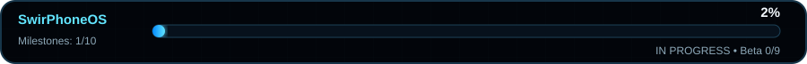

# SwirPhoneOS Roadmap

<!-- SWIR-ROADMAP-STANDARD:v1 -->

## Overall progress

**2% — weighted engineering milestones.**

| Completed milestones | Remaining | Total | Weighted progress |
| --- | --- | --- | --- |
| 1 | 9 | 10 | 2% |

The canonical ledger is `project.json`. Weights total 100 and only evidence-complete gates contribute. Source scaffolding, host tests, provenance tooling, read-only hardware correlation, transaction preparation evidence and desktop packaging do not substitute for an Android build, boot or physical-device validation. Beta readiness remains **0/9 gates passed**.

| Gate | Weight | Completion evidence required |
| --- | ---: | --- |
| foundation | 2 | Architecture, safety/release contracts, executable ledger validation and negative tests |
| desktop_diagnostics | 8 | Tested read-only ADB/Fastboot/FastbootD diagnostics, profile validation, useful desktop UI and real Windows/USB smoke evidence |
| aosp_baseline | 10 | Pinned upstream manifest, reproducible environment and completed platform build |
| emulator_boot | 10 | Swir product boots into usable Android UI; recorded runtime and regression tests |
| gsi_validation | 10 | Built ARM64 GSI plus relevant Treble/VTS evidence and known-issues matrix |
| reference_hardware | 25 | Exact-model physical boot and validated telephony/connectivity/audio/cameras/sensors/storage/charging/thermal/suspend/encryption |
| install_restore | 15 | User-confirmed safe installation and tested recovery/stock restore on the same device/firmware profile |
| swir_ux | 8 | Integrated launcher/SystemUI/settings and essential Swir apps, i18n, accessibility and visual/runtime review |
| security_ota | 8 | Release signing, update authenticity, security review, tested update/rollback/recovery including SwirRoot interaction where enabled |
| beta_release | 4 | All beta gates reviewed, real images and Windows package published and post-release verified |

## Verified milestone checklist

- [x] foundation
- [ ] desktop_diagnostics
- [ ] aosp_baseline
- [ ] emulator_boot
- [ ] gsi_validation
- [ ] reference_hardware
- [ ] install_restore
- [ ] swir_ux
- [ ] security_ota
- [ ] beta_release

## Current engineering slices

### Platform, build provenance and runtime evidence

Android 17 / API 37 is pinned to `android-17.0.0_r1`. Exact-tag planning, build-host preflight, resolved-manifest SHA validation and bounded AOSP staging exist. The dedicated builder now also verifies every project from the exact `repo manifest -r` snapshot before staging and again after the build: each manifest project must be a real in-workspace Git worktree, `HEAD` must equal the pinned revision, tracked changes are rejected and non-ignored untracked source is rejected except exact nested Repo project roots. The exact Git executable bytes/path identity and aggregate project state are recorded without exposing the raw local Git path. Schema-v5 staging still requires the exact reviewed regular-file set under `vendor/swir/` both before and after compilation, rejecting stale files, generated extras, symlinks and hard-link aliases rather than silently cleaning a persistent builder workspace.

The dedicated builder workflow records bounded failure evidence and binds successful runs to exact preflight, AOSP plan, resolved manifest, staged source, build identity and optional runtime. A separate source-trust bundle re-hashes the exact resolved-manifest evidence already bound by the run and requires identical clean pre/post-build source state plus the same exact Git tool identity. Build evidence requires the exact `swirphoneos_cf_x86_64` identity, Android 17/API 37, build ID `CP2A.260605.016`, security patch `2026-06-05`, `userdebug`, non-empty `boot.img` and `system.img`.

`aosp-run-evidence` binds one workflow source commit to builder preflight, AOSP plan, resolved manifest, pre/post-build staging, build evidence and—when requested—the complete runtime/smoke/bundle group. Runtime still requires `sys.boot_completed=1`, exact product/device/manufacturer identity and every source-ready package with a package-local launcher. Emulator-only smoke requires successful `am start -W` plus resumed-foreground confirmation. The runtime path now also exercises every source-ready package under every checked-in EN/PL/NB/DE/ES/FR/PT/AR per-app locale, verifies exact locale restoration, binds boot/launch/locale evidence into one runtime-review report, and keeps that entire review inside the same exact-adb byte-continuity window. A final fail-closed review-trust bundle revalidates canonical run, tool-trust and locale-review digests plus the exact build fingerprint, app-manifest, package set and locale set. Visual RTL, accessibility and visual translation claims remain false until focused review. None of these reports is physical-device evidence and none auto-promotes app status.

No completed source sync, Kati/Soong build or Cuttlefish boot exists yet, so `aosp_baseline` and `emulator_boot` remain incomplete.

### Physical-device observation, install, rollback and recovery evidence

ADB diagnostics capture exact reported firmware fingerprint, board/hardware, slot and verified-boot/VBMeta state hints through a strict read-only allowlist. Fastboot can optionally collect bounded `has-slot:<partition>` and `partition-size:<partition>` hints for reviewed partition names; it does not expose `getvar all`, reboot, unlock, flash, erase, format or slot-change operations.

Saved ADB and Fastboot reports can be correlated only when profile/model/codename/build and non-conflicting slot/bootloader hints agree. The result remains `CORRELATED_READ_ONLY_NOT_VERIFIED`, with hardware verification, support, writes, flashing and root all false. The current `avicii` profile still has no verified partition map, firmware baseline, SwirPhoneOS build or physical restore evidence.

The transaction evidence layer binds exact target and rollback artifacts to one profile/current-build/target-build tuple, verifies exact sizes and SHA-256, rejects unsafe paths/symlinks/duplicate keys and can create a new fsynced recovery journal. Journals state `owner_confirmation_recorded=false` and `write_allowed=false`.

### Android application source

All twenty essential applications are now **`ANDROID_SOURCE`** and included in the Cuttlefish product: Swir Phone, Swir Contacts, Swir Messages, Swir Camera, Swir Gallery, Swir Files, Swir Settings, Swir Browser, Swir Clock, Swir Calculator, Swir Notes, Swir Recorder, Swir Calendar, Swir Weather, Swir Update, Swir Backup, Swir Privacy, Swir Device Care, Swir Apps and SwirRoot. No essential app remains `HOST_CONTRACT`; all twenty still remain below `ANDROID_RUNTIME`.

The validator uses exact least-privilege permission allowlists. Swir Phone is limited to `READ_CALL_LOG`, Contacts to `READ_CONTACTS`, Gallery to `READ_MEDIA_IMAGES` + `READ_MEDIA_VIDEO`, Recorder to `RECORD_AUDIO`, and Browser/Weather to `INTERNET`; the remaining source apps are permission-free. Swir Phone does not request `CALL_PHONE` or `WRITE_CALL_LOG`, and its recent-call path has no provider insert/update/delete primitive. Network primitives are rejected outside the reviewed Browser/Weather paths; broad storage and process execution remain rejected across production Java source. Every app has EN/PL/NB/DE/ES/FR/PT/AR resources with exact key/formatter/plural checks and RTL-aware application configuration.

Camera provides CameraManager capability inspection plus explicit owner-visible Android capture hand-offs, while direct Camera2 capture/photo/video claims remain open until exact hardware validation. Browser provides HTTPS-first browsing with conservative defaults plus app-scoped owner-visible `DownloadManager` downloads; real redirect/provider behavior remains runtime-unverified. Weather provides bounded HTTPS Open-Meteo forecast retrieval for owner-entered coordinates without location permission. Swir Backup now creates bounded owner-selected schema-v2 document archives with per-file SHA-256, strict inspection and SAF restore into an explicitly chosen folder. Legacy schema-v1 backup archives remain inspect-only. This document restore path does not read private app data or partitions and does not satisfy device install/recovery rollback orchestration.

Phone now has source-implemented owner-controlled default-dialer role request, in-call answer/reject/end controls and bounded read-only recent-call history. Recent calls require the default-dialer role plus an explicit runtime `READ_CALL_LOG` grant, cap output at 20 entries, hide restricted/private caller presentation and never mutate the call-log provider. Real Telecom/modem/IMS behavior remains runtime- and hardware-unverified. Messages still has `mms` and `conversation_history` open; Camera keeps `photo_capture` and `video_capture` open; Calendar's owner-visible `provider_bridge` is source-implemented but remains runtime/provider-app unverified; Backup keeps the broader `restore_orchestration` target open beyond its current owner-selected document restore; Apps keeps `update_status` open; SwirRoot keeps guided enable/unroot open. Source-summary schema v3 tracks these gaps per app.

SwirRoot remains a source-stage control surface only. Its mutation backend and supported-build switch are hard-disabled, it reports `UNAVAILABLE`, and it contains no `su`, process execution, boot-image mutation, partition write, unlock, flash or exploit path. `guided_enable` and `guided_unroot` require an exact physically verified backend plus rollback/recovery evidence.

All twenty remain below `ANDROID_RUNTIME`. Source-only work therefore receives **no weighted gate credit** and the global percentage remains 2%.

### Desktop and SwirRoot

Read-only ADB/Fastboot/FastbootD diagnostics, multilingual SwirPhoneStudio, the owner-visible create-only physical capture wizard and Windows developer packaging exist, but real owner-controlled Windows USB ADB + Fastboot/FastbootD evidence is still missing. Cross-transport evidence and local transaction evidence provide future prerequisites for exact-device/recovery-aware installation, but no write controls are exposed. SwirRoot Android source is present, but there is no exact-build mutation implementation, supported root build, physical enable/unroot path, recovery proof or privileged authorization backend.

## System app delivery track

### Emulator/core phase

- [ ] Shared SwirPhoneOS design system, icon rules, package naming, localization and permission conventions integrated into the built Android image.
- [ ] Settings, Files, Update, Privacy and Device Care usable with real runtime/platform state.
- [ ] All twenty essential source-ready apps built and exercised inside SwirPhoneOS Cuttlefish.
- [ ] Runtime permission UX, accessibility, RTL and locale-switch review for every bundled app.

> Source progress: all twenty essential apps contain meaningful Android source and host-tested policy/logic where appropriate, but the checkboxes stay open until the image builds and the apps are exercised. The global percentage therefore remains 2%.

### Reference-hardware phase

- [ ] Swir Phone in-call/default-dialer/recent-call behavior and Swir Messages default-role/provider/MMS/carrier behavior validated against the exact reference telephony stack; Contacts runtime/provider behavior validated on that same build.
- [ ] Swir Camera direct capture validated against the exact reference camera/media stack before photo/video capabilities are promoted.
- [ ] Swir Gallery scoped MediaStore behavior and Swir Recorder capture/playback/export validated on the supported build.
- [ ] Swir Backup/restore aligned with exact encryption/storage/recovery behavior and tested restore evidence.
- [ ] Calendar provider bridge plus Browser download runtime behavior, Weather runtime networking and Swir Apps update integration brought to beta-appropriate quality.

### SwirRoot phase

- [x] Source-ready permission-free owner UI/service foundation with `UNAVAILABLE` default, explicit confirmation and fail-closed policy review.
- [ ] Authoritative ROOT OFF / ROOT ON / UNAVAILABLE state for an exact physically verified build/profile.
- [ ] Enable-root requires exact supported build/profile, owner confirmation, verified rollback material, durable transaction journaling and safe update state.
- [ ] Unroot restores the expected non-root boot/system state on the exact build/profile.
- [ ] Per-app root authorization is deny-by-default, revocable and auditable through a real privileged backend.
- [ ] SwirRoot integrates with Swir Update, recovery and SwirPhoneStudio.
- [ ] Physical enable → reboot → use → disable → recovery validation before any beta root claim.

## Next engineering work

1. Provision or attach a capable dedicated Linux x86-64 runner labeled `swir-aosp-builder`, set `SWIR_AOSP_WORKSPACE`, ensure Cuttlefish host prerequisites plus the trusted absolute `adb` path exist, and run the manual `AOSP build evidence` workflow with runtime collection enabled. It must initialize/sync exact `android-17.0.0_r1`, preserve `repo manifest -r`, prove every manifest project is at the pinned revision with a clean pre-build source capture, stage the bounded `vendor/swir/` bundle and compile `swirphoneos_cf_x86_64-aosp_current-userdebug` with all twenty source-ready apps.
2. Preserve `builder-preflight.json`, `aosp-plan.json`, `resolved-manifest.json`, `source-prebuild-evidence.json`, `stage-report.json`, `post-build-stage-evidence.json`, `source-postbuild-evidence.json`, `build-evidence.json`, `runtime-evidence.json`, `app-smoke-evidence.json`, `runtime-i18n-evidence.json`, `runtime-review-evidence.json`, `evidence-bundle.json`, `aosp-run-evidence.json`, `source-trust-bundle.json`, `runtime-trust-bundle.json` and `runtime-review-trust-bundle.json`. The final run report must be `BUILD_AND_RUNTIME`; source trust must prove unchanged exact clean Git state across the build; and the final review-trust bundle must bind that exact run to the unchanged trusted adb identity, exact app manifest and complete checked-in locale matrix before any runtime promotion review.
3. Fix any real Repo/Kati/Soong/AAPT/Cuttlefish regressions first. Do not weaken pinned build identity, clean source integrity, staged-source integrity, exact permission allowlists, package-set, locale-set, adb-tool or fingerprint continuity merely to obtain a green build.
4. Perform focused interactive checks automated launch/locale smoke cannot prove: core Settings/Files/Update/Privacy/DeviceCare flows; Phone default-role request, `READ_CALL_LOG` permission denial/grant, restricted-number privacy, recent-call list and in-call controls; Messages hand-off; Camera capability report and capture hand-offs; Browser HTTPS/privacy/download behavior; Weather network/error/unit behavior; Backup schema-v2 create/inspect/restore plus failure cleanup; Notes/Calendar persistence/export; Clock timer/alarm; Gallery; Recorder; Contacts; Swir Apps; SwirRoot; accessibility, text expansion, locale-specific formatting/input/fonts and Arabic RTL visual mirroring. Only then review any `ANDROID_RUNTIME` promotion.
5. On the owner-controlled `avicii`, capture read-only ADB and Fastboot/FastbootD observations and correlate them with `hardware-evidence`. Review exact firmware fingerprint, slots and bounded partition hints while keeping the result below hardware verification and the profile `PLANNED_NOT_SUPPORTED`.
6. Only after physical observations are reviewed should a device-specific transaction plan be authored. Bind it with `transaction-device-check`, verify target+rollback bytes and create a recovery journal. Physical restore evidence and a verified partition map remain mandatory before any write-capable implementation.
7. Continue SwirPhoneStudio hardening; the next desktop gate evidence is actual Windows USB read-only ADB + Fastboot/FastbootD smoke on an owner-controlled device.
8. After emulator/GSI and recovery evidence, design a legitimate exact-build SwirRoot backend only for explicitly supported unlocked/owner-controlled device paths. Never bypass locked bootloaders, OEM protections or verification controls through exploits.
9. Expand device packs into reviewed installation/recovery plans only after exact-device evidence exists. Never enable generic writes from Treble/codename/unlocked state alone.

## Release stages

Developer preview: usable emulator/GSI plus developer instructions. Alpha: physical-device boot and documented recovery. Beta: every mandatory `BETA_RELEASE_GATE.md` item passed for the exact candidate. Stable: stronger sustained runtime/update/recovery/security validation.

No release gate is weakened to make a version number advance.